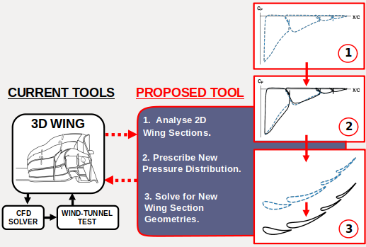
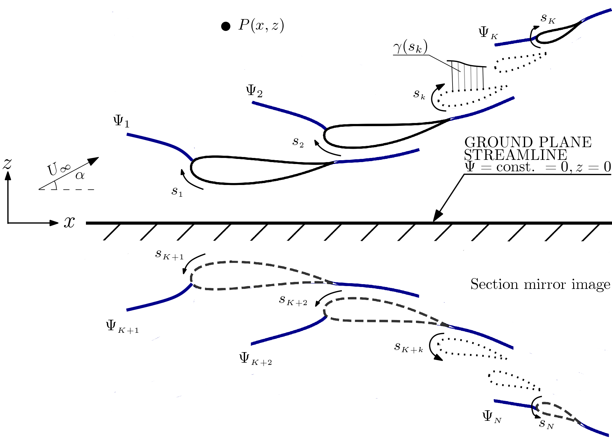

# Inverse-Design-Tool-for-Multi-Element-Wing-Sections-in-Ground-Effect

This tool was partly developed as my BEng dissertation project at The University of Southampton. The details of the work can be found in this report: [Inverse Design Tool for Multi Element Wing Sections in Ground Effect](/IP_Final.pdf)  The report covers the development of the theoretical models for potential-flow analysis and design, validation of their implementations and examples for a range of design applications. 

## Background and Motivation
The use of development tools for aerodynamic design in Formula 1 is strictly regulated by the sports governing body FIA [1]. This leads to the design process being limited by the allowed allocation of computational resource, opening up for the use of lower cost, lower fidelity design tools to complement conventional CFD and wind-tunnel testing in the design process. The development of such a tool is the subject of this work.

The tool targets design problems where the solution can be prescribed as a pressure distribution and the corresponding geometry solved for. A potential-flow based panel-method is effectively cost-less on modern computers, making it an ideal formulation for this application. 

* Modified workflow of the wing-design process using this tool:

## Potential Flow Analysis and Design Methodology
The problem is modelled by considering a wing-section of K-elements and its mirror-image about the plane z=0, resulting in a total of N-bodies in the field where N=2K. The mirror-image is used to model ground effect on the section by creating a flow-field symmetrical about the mirror plane. This ensures z=0 becomes a streamline in the flow, where by symmetry the streamfunction value Ψ=0, which can then be taken as the ground plane. Varying ground clearance can be considered by adjusting the distance of the section to the ground plane.

* General model of the analysis method. A wing section of K-elements and its mirror-image is modelled as vortex sheets superpositioned with a freestream flow:

The elements in a section and its mirror-image is modelled by vortex sheets discretised into M-panels. Specifying constant streamfunction values on the surface, with a Kutta-condition for each element, a closed linear system is formed and solved for the vortex strengths that would make each element a stremline in the flow.

NOTE: This tool was developed for my own personal use and is currently not very user friendly. The idea is to work on it further in the future to make it usable without having to dig into the code so much.  
